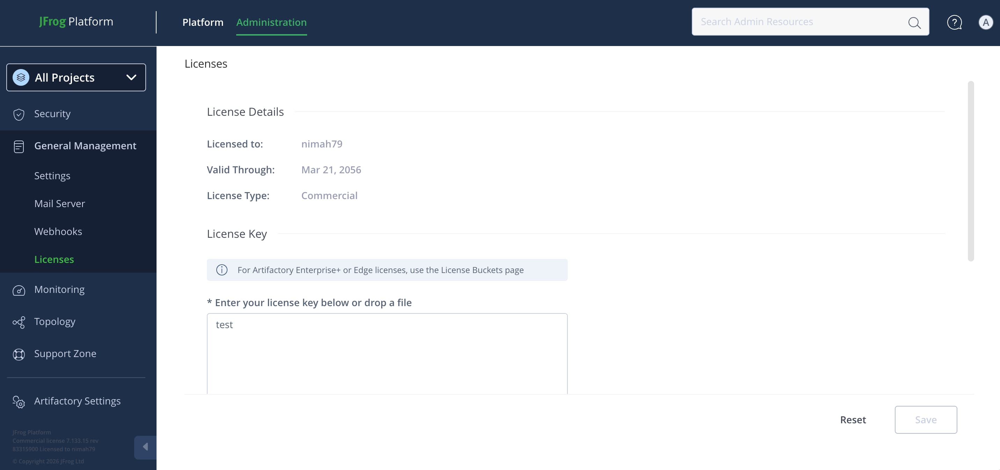

# [JFrog Artifactory](https://jfrog.com/artifactory/) License Patcher

A javaagent that returns a hardcoded license for [JFrog Artifactory](https://jfrog.com/artifactory/).

Latest tested version: [7.133.15](https://docs.jfrog.com/releases/docs/artifactory-self-managed-releases#artifactory-713315-self-managed)

**⚠️ YOU SHOULD NEVER USE THIS PROJECT TO CRACK/PATCH/ ILLEGAL USE JFROG ARTIFACTORY. THIS PROJECT IS FOR EDUCATIONAL PURPOSES! THE CONSEQUENCES CAUSED BY THE USE OF THIS SOFTWARE SHALL BE BORNE BY THE USER.**

## Installation

1. Start the services using [Docker Compose](https://docs.docker.com/compose/):

```shell
docker compose up
```

2. In the JFrog Artifactory licenses page, write any random text and click "Save".



## Building the javaagent

The prebuilt jar file of the javaagent is available in `jfrog-artifactory-license-patcher-1.0.jar`. However, if you have modified the source code, you can build the jar file using the following command:

```shell
mvn clean package
```
